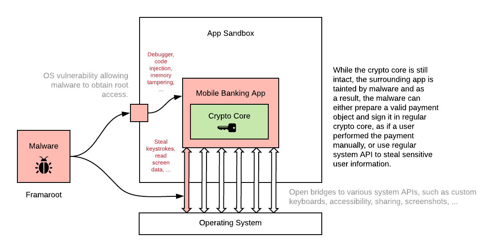

# Note on Cryptography and Mobile Runtime Security

While we implement the cryptographic core as an isolated component in C/C++ to have as much control over the runtime and memory, the mobile application that uses our SDK ultimately runs inside a potentially insecure mobile operating system. As such, the technical integrators of our SDK should consider attacks based on the weaknesses of mobile runtime.

This chapter attempts to provide an explanation of the issues to allow more informed risk considerations, and also offer possible solutions.

## Mobile OS Security

Any security-related code, such as cryptographic core, ultimately runs in a mobile operating system, such as iOS or Android. While Apple and Google do their best to build secure software, hackers always find a way to bypass system security features. The general availability of jailbreak/rooting is a living testament to this, as well as the rise of Android mobile malware.

When running in a vulnerable OS, apps can be manipulated by an attacker (for example, via mobile malware, or techniques such as “trust-jacking”) that is either:

- armed with a rooting framework (and hence can penetrate through the sandboxing features of a mobile OS, even on devices that were not previously rooted by the user), or …
- merely misusing some of the commonly available system interfaces, such as the ability to install their own keyboards or screen readers in the system.

### Examples of Attacks

Hackers can use the OS weaknesses and system interfaces to bypass existing security measures implemented in the mobile app. While this attack does not directly target the cryptographic core, it draws any security-related code ineffective since signatures can no longer be trusted. In other words, attackers will likely not tamper with the cryptographic core directly, but instead, they will try hijacking the surrounding application to call the intact cryptographic core from the application code.

An example of such an attack may look like this:

1. An attacker roots/jailbreaks/failbreaks the device.
2. The attacker either:
    - connects the debugger to the running app (attack "at runtime"), or
    - modifies the code of an application bundle by repackaging (attack "at rest")
3. The attacker records the PIN code entered by the user, by listening to events on the UI components via debugger or by logging the events using modified code.
4. The attacker prepares a fake payment and calls the cryptographic core with the payment data and a captured PIN code.

Note that the attack may be even performed without root on some devices and operating systems, using some insufficient system design. For example:

1. An attacker can prepare an app with Accessibility service support on Android and trick the user into activating such a service.
2. The attacker can record the PIN code using the accessibility service in the case of an incorrect PIN code implementation.
3. The attacker can launch the app from the background:
    - use the accessibility service to replay the PIN code
    - navigate through the app using taps and other gestures
    - type in the payment details
    - replay the PIN code again and confirm the payment

As a result, mobile apps with high-security requirements cannot rely on the OS security features. Instead, they need to protect themselves with advanced obfuscation, app integrity checks, and proactive anti-tampering features.

## Attack Vectors

There are several attack vectors that you should take into account:

- **Rooting / Jailbreaking** - These terms represent a modification of mobile OS that essentially removes any built-in security measures, such as application sandboxing or permission control. While this change is usually harmless on its own, it is a strong enabler for several subsequent attack vectors, such as:
    - **Debugger Connection** - By connecting the debugger to the running application, the attacker gains control over any data visible in the application code (for example, can read labels and buttons titles, intercept touches, etc.) and can manipulate the application code execution (for example, modify outcomes of methods, call any methods, navigate the user interface, etc.)
    - **App Repackaging** - By bypassing the application sandbox, an attacker may change or replace the application on the device with a fraudulent app version. This may be either a completely different app or an original app with some additional malicious code that logs events to obtain data from the app or changes the app behavior to execute undesired business logic.
    - **Framework Injection or Native Code Hooks** - The attacker does not have to modify the application code directly. Instead, the attacker can modify a system framework or a library and change the behavior of any application indirectly as a result. This allows an attacker to modify the behavior of any app on a device without knowing much about a particular app code or structure.
    - **Device Cloning** - By bypassing the application sandbox, the attacker can obtain any data stored inside the application sandbox, including some records inside the protected space (such as records inside the iOS Keychain that are not protected, for example, using biometry). This alone does not allow bypassing cryptographic algorithms such as PowerAuth - the data stored in the sandbox are further encrypted using a PIN code or stored in Secure Enclave in the case of biometry. The attacker may, however, get access to some secondary data, such as "possession factor" related signing keys, identifiers, or other data cached by the application.
- **Accessibility Services** (Android) - By tricking users into enabling the Accessibility service, the attacker can read anything that happens on the device screen, or even perform gestures and type the text. This indeed presents a significant problem to any application that needs to keep the user data secure. Information about accounts or transactions may leak through the accessibility services, as well as PIN codes or passwords (in the case of an incorrect text entry implementation). The fact that many well-known apps misuse the Accessibility service for some "acceptable" tasks does not help as well...
- **Malicious Keyboards** - Mobile operating systems allow installing their own keyboard that may use custom logic to handle the user input. This obviously presents some possible security issues, especially when handling sensitive data, such as passwords or PIN codes. Custom keyboards can also be used to perform overlay attacks (the keyboard would occupy bigger than usual space to present a fake UI over the screen) on the Android operating system.

Of course, the attacker can combine the vectors above quite creatively (for example, device cloning with PIN code theft) to amplify the damage.

<!-- begin box info -->
Rooting and jailbreaking are generally terms used for a complete replacement of a legitimate OS with an OS that removes all protective mechanisms. However, the attacker does not need to do full rooting or jailbreaking to gain access to some system permissions. Instead, the attacker can merely misuse some system vulnerability to escalate user permissions. In such a case, the result is in principle the same as if the attacker performed a full jailbreak or rooting: complete control over the end user's system.
<!-- end -->

## Typical Remedies

Generally speaking, it is not simple to reliably fix the issues mentioned above with a "naive" implementation. In case you implement, for example, a rooting detection in the code, the malware with root access can find that particular code and disarm it. You would be surprised how easy this usually is - in the case of root, all you need to do is look for strings such as `"/sbin/su"` or `"/su/bin/su"`.

As a result, a new category of solutions emerged to provide less straightforward, sophisticated solutions that combine code obfuscation, evasion techniques, integrity checking, proactive anti-tampering features, and other protective measures. These solutions are called [Mobile App Shielding](https://wultra.com/mobile-app-shielding), or RASP (Runtime Application Self-Protection).

Unless you are looking for a strictly formal fix (meaning "making the pen-testers happy, while not fixing the actual issue"), we strongly suggest you deploy such technology.

We encourage you to use any system-provided protection measures as much as possible while coding your application, such as:

- Built-in secure storage (iOS Keychain with Secure Enclave, Android KeyStore with StrongBox).
- App transport security to enforce newer TLS standards, check for the correctness of the certificate and disallow any HTTP connections.

However, please note that on a compromised device, these features may be disabled or bypassed, and therefore, they will not help to make your application secure.
