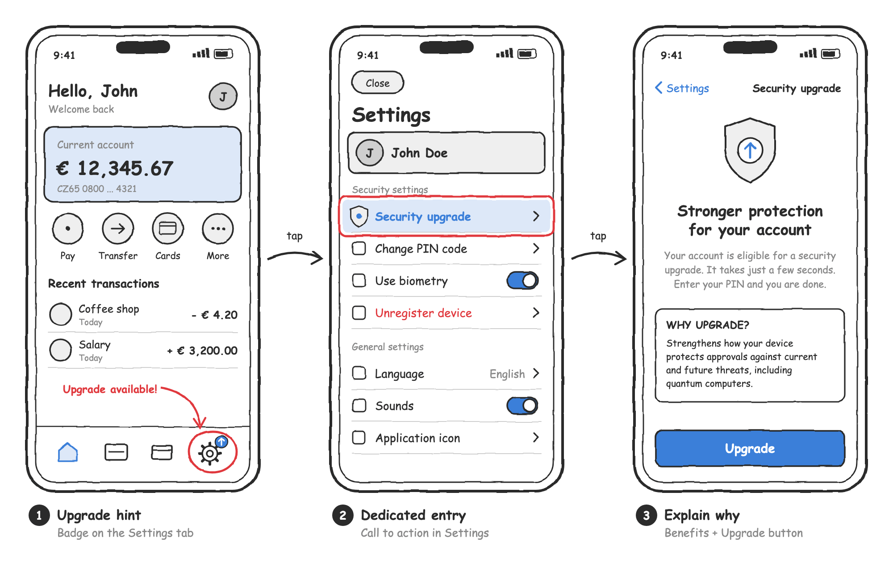
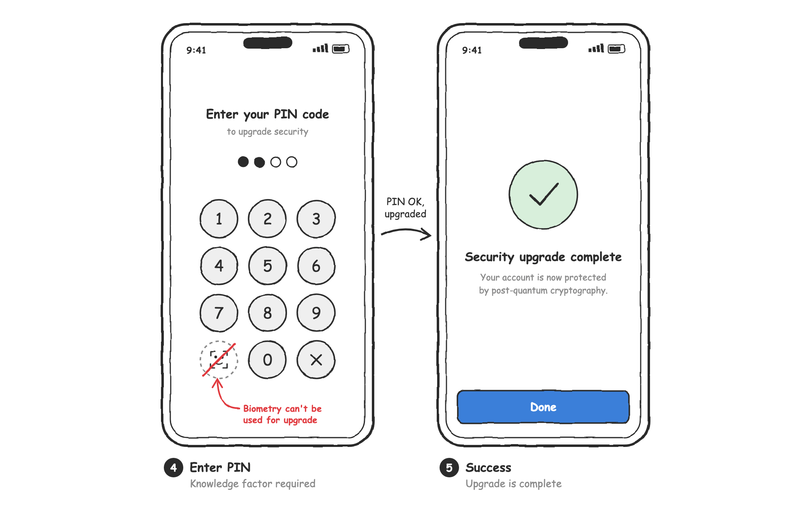
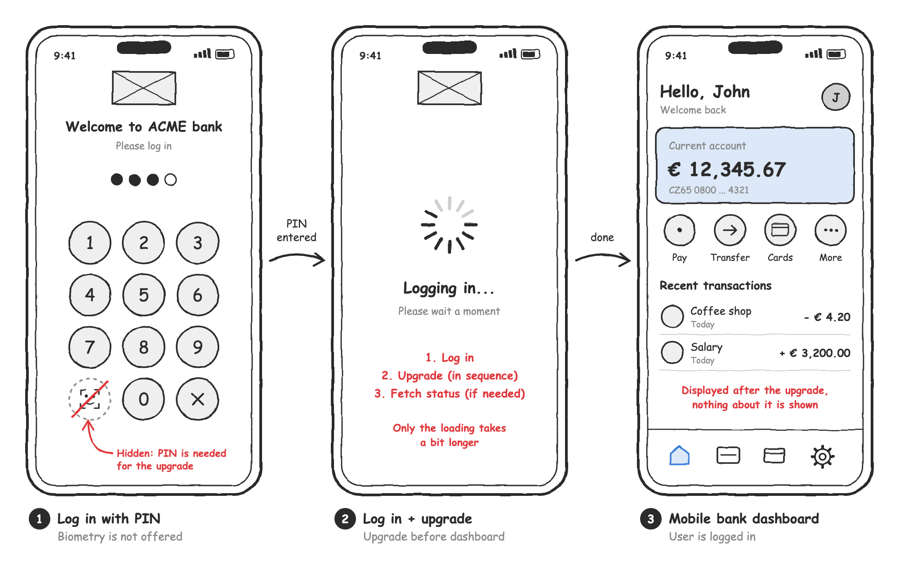

# Upgrading to Post-Quantum Cryptography

PowerAuth Mobile SDK `2.0.0` introduces PowerAuth protocol version 4.0 with post-quantum cryptography. When you migrate your application from SDK `1.x` to SDK `2.x`, you need to decide how your user base should transition from the classical protocol 3.3 to the new protocol 4.0. This document helps you make that decision. It describes the available migration strategies, explains their pros and cons, and shows how to implement each of them.

This document complements the [Migration from 1.9.x to 2.0.x](Migration-from-1.9-to-2.0.md) guide, which remains the primary source of information about the API changes in SDK `2.0.0`.

<!-- begin box info -->
Choosing the right strategy depends on your business, security, regulatory, and infrastructure requirements. If you have any questions or need help deciding which strategy fits your situation, do not hesitate to contact Wultra support at [support@wultra.com](mailto:support@wultra.com) (or any other channel you have).
<!-- end -->

## Table of Contents

- [Why Move to Post-Quantum Cryptography](#why-move-to-post-quantum-cryptography)
- [Terminology](#terminology)
- [Before You Start](#before-you-start)
- [Choosing a Strategy](#choosing-a-strategy)
- [Strategy 1: Full Migration](#strategy-1-full-migration)
- [Strategy 2: Organic Migration](#strategy-2-organic-migration)
- [Strategy 3: Legacy Mode](#strategy-3-legacy-mode)
- [Frequently Asked Questions](#frequently-asked-questions)

## Why Move to Post-Quantum Cryptography

The classical PowerAuth protocol 3.3 relies on elliptic curve cryptography (ECC). Once quantum computers reach sufficient scale and stability, ECC and other commonly used asymmetric algorithms will no longer provide the expected level of protection. Although such computers are not available today, there are several reasons to start the transition now:

- **Analysts and standardization bodies agree on the risk.** NIST has already standardized the post-quantum algorithms ML-KEM and ML-DSA, and leading analysts expect that advances in quantum computing will weaken conventional asymmetric cryptography by the end of this decade.
- **Regulators are defining transition timelines.** For example, the European Commission recommends that member states start transitioning to post-quantum cryptography by the end of 2026, and that critical infrastructures are transitioned no later than the end of 2030.
- **Banks are requiring quantum readiness.** Quantum readiness is becoming a baseline requirement in tenders for new authentication solutions, because these systems are expected to protect customers for many years.
- **Migrations take time.** Migrating a whole user base to a new protocol takes months or even years. Starting early keeps you in control of the timeline and prevents rushed decisions later.
- **Quantum computing progress keeps accelerating.** A single breakthrough can significantly shorten the time left for a smooth transition.

PowerAuth protocol 4.0 uses a **hybrid** scheme by default. It combines the well-established elliptic curve cryptography (P-384) with the post-quantum ML-KEM and ML-DSA algorithms. The resulting protection is at least as strong as the classical cryptography, and it also resists attacks by future quantum computers.

You can read more in the [5 Proof Points That the Timing Is Right for Post-Quantum Authentication](https://www.wultra.com/blog/5-proof-points-that-the-timing-is-right-for-post-quantum-authentication) article on our blog.

## Terminology

| Term | Explanation |
|------|-------------|
| **SDK** | PowerAuth Mobile SDK for iOS, tvOS, watchOS, or Android. In this document, "SDK 1.x" means version `1.9.x` and older, and "SDK 2.x" means version `2.0.0` and newer. |
| **PowerAuth Server** | The server-side component that the SDK communicates with. Protocol 4.0 requires PowerAuth Server `2.0.0` or later. |
| **Protocol 3.3** | The classical PowerAuth protocol (`V3.3`) used by SDK `1.9.x`. It's based on P-256 elliptic curve cryptography and is not quantum-resistant. |
| **Protocol 4.0** | The new PowerAuth protocol (`V4.0`) introduced in SDK `2.0.0`. It uses P-384 elliptic curve cryptography, optionally combined with the post-quantum ML-KEM and ML-DSA algorithms, and a modern AEAD-based end-to-end encryption. |
| **PQC** | Post-Quantum Cryptography. Cryptographic algorithms designed to resist attacks by quantum computers, such as ML-KEM (key encapsulation, FIPS 203) and ML-DSA (digital signatures, FIPS 204). |
| **PQA** | Post-Quantum Authentication. User authentication protected by post-quantum cryptography. In PowerAuth, it's achieved by using protocol 4.0 with a hybrid algorithm. |
| **Hybrid scheme** | A combination of classical and post-quantum algorithms. An attacker must break both of them to compromise the protection. |
| **Algorithm** | A set of cryptographic algorithms used by the SDK, configured via `PowerAuthAlgorithm`. `DEFAULT` maps to `EC_P384_ML_L3` (hybrid, post-quantum). See [Algorithms for Communication](PowerAuth-SDK-for-Android.md#algorithms-for-communication). |
| **Legacy (legacy mode)** | SDK 2.x configured with the `LEGACY_P256` algorithm. In this mode, the SDK uses protocol 3.3, so it's fully compatible with PowerAuth Server `1.9.x` and doesn't provide post-quantum protection. |
| **Activation** | Enrollment of the mobile application (device) to a user account. An activation is always bound to the protocol version that was used to create it, or to which it was upgraded. |
| **Protocol upgrade** | An authenticated process that migrates an existing activation from protocol 3.3 to protocol 4.0. See [Authenticated Protocol Upgrade](PowerAuth-SDK-for-Android.md#authenticated-protocol-upgrade). |
| **Mobile SDK configuration** | The `MOBILE_SDK_CONFIG` string provided by PowerAuth Server. It contains the application credentials and master public keys required by the configured algorithm. |
| **Knowledge factor** | Something the user knows, typically a PIN or password. The protocol upgrade must always be authenticated with the knowledge factor. |

## Before You Start

<!-- begin box warning -->
All strategies described in this document require PowerAuth Mobile SDK `2.0.0` or later. This means that you must always integrate the API changes described in the [Migration from 1.9.x to 2.0.x](Migration-from-1.9-to-2.0.md) guide, regardless of the strategy you choose.
<!-- end -->

The strategy only determines how the SDK is configured and whether, when, and how your existing users are upgraded to the new protocol. It also affects the minimum required version of PowerAuth Server. Check the [compatibility](Migration-from-1.9-to-2.0.md#compatibility-with-powerauth-server) section of the migration guide for more details.

### Changes You Cannot Revert

Plan your rollout carefully, because some changes are one-way:

- **There's no protocol downgrade.** Once an activation is upgraded to protocol 4.0, or created with protocol 4.0, it cannot go back to protocol 3.3.
- **SDK 1.x cannot use protocol 4.0 activations.** Activations on protocol 4.0 are stored in a new data format that SDK 1.x doesn't recognize. If you roll your application back to a version with SDK 1.x, these users lose their activation and have to activate the application again.
- **PowerAuth Server 1.9 doesn't support protocol 4.0.** Once there are activations on protocol 4.0, you cannot roll PowerAuth Server back to version `1.9.x` without breaking them.
- **The algorithm of a protocol 4.0 activation is fixed.** Changing the algorithm in the SDK configuration later doesn't change existing protocol 4.0 activations. See [Choosing the Algorithm](#choosing-the-algorithm).

Activations that remain on protocol 3.3 keep the data format used by SDK `1.9.x`. If you want to keep the option to roll back to an application with SDK 1.x during the rollout, release SDK `2.0.0` with the [legacy mode](#strategy-3-legacy-mode) first. Once the new version is stable and widely adopted, switch to the `DEFAULT` algorithm in a later release.

## Choosing a Strategy

| | Strategy 1: Full Migration | Strategy 2: Organic Migration | Strategy 3: Legacy Mode |
|---|---|---|---|
| **New users** | Protocol 4.0 | Protocol 4.0 | Protocol 3.3 |
| **Existing users** | Upgraded to protocol 4.0 | Remain on protocol 3.3 | Remain on protocol 3.3 |
| **Post-quantum protection** | Whole user base, as soon as possible | Grows gradually over time | None |
| **Additional UI/UX changes** | Yes | No | No |
| **PowerAuth Server** | `2.0.0+` | `2.0.0+` | `1.9.0+` |
| **Recommendation** | Recommended | Acceptable | Backup only |

## Strategy 1: Full Migration

In this strategy, your whole user base is migrated to protocol 4.0:

- **New users** are activated with protocol 4.0 and no further action is required.
- **Existing users** are offered the protocol upgrade. Until the upgrade is done, they can use the application normally, without any limitations. The SDK knows which protocol each activation uses and handles it automatically, so there's no special handling required on your side.

### SDK Configuration

To support both existing activations on protocol 3.3 and new activations on protocol 4.0, the `PowerAuthSDK` instance must be configured with:

- The **mobile SDK configuration** obtained from PowerAuth Server `2.0.0` or later. This configuration contains master public keys for both the legacy and the new algorithms. The configuration string from PowerAuth Server `1.9.x` contains only the legacy key and cannot be used with the new algorithms.
- The **`DEFAULT` algorithm**, or any other non-legacy algorithm. See [Algorithms for Communication](PowerAuth-SDK-for-Android.md#algorithms-for-communication) for the list of available algorithms.

<!-- begin box warning -->
Post-quantum keys are much larger than classical elliptic curve keys. For example, an ML-DSA-65 public key has 1952 bytes and an ML-DSA-87 public key has 2592 bytes, while a P-256 public key has only 65 bytes. As a result, the new mobile SDK configuration string grows from about a hundred characters to several thousand characters. Make sure that every place where you store the configuration can handle it, such as build scripts, environment variables, or resource files.
<!-- end -->

Before, with SDK `1.9.x`:

<!-- begin codetabs Android iOS -->
```kotlin
val configuration = PowerAuthConfiguration.Builder(
    INSTANCE_ID,
    API_SERVER,
    MOBILE_SDK_CONFIG)  // Configuration from PowerAuth Server 1.9
    .build()
val powerAuthSDK = PowerAuthSDK.Builder(configuration)
    .build(applicationContext)
```
```swift
let configuration = PowerAuthConfiguration(
    instanceId: Bundle.main.bundleIdentifier!,
    baseEndpointUrl: "https://<your-domain>/enrollment-server",
    configuration: "ARDDj6EB6iAUtNm...KKEcBxbnH9bMk8Ju3K1wmjbA==") // Configuration from PowerAuth Server 1.9
guard let powerAuthSDK = PowerAuthSDK(configuration: configuration) else {
    // Invalid configuration
}
```
<!-- end -->

After, with SDK `2.0.x`:

<!-- begin codetabs Android iOS -->
```kotlin
val configuration = PowerAuthConfiguration.Builder(
    INSTANCE_ID,
    API_SERVER,
    MOBILE_SDK_CONFIG)  // Configuration from PowerAuth Server 2.0+
    .algorithm(PowerAuthAlgorithm.DEFAULT)
    .build()
val powerAuthSDK = PowerAuthSDK.Builder(configuration)
    .build(applicationContext)
```
```swift
let configuration = PowerAuthConfiguration(
    instanceId: Bundle.main.bundleIdentifier!,
    baseEndpointUrl: "https://<your-domain>/enrollment-server",
    configuration: "ARDDj6EB6iAUtNm...KKEcBxbnH9bMk8Ju3K1wmjbA==", // Configuration from PowerAuth Server 2.0+
    algorithm: .DEFAULT)
let powerAuthSDK = try PowerAuthSDK(configuration: configuration)
```
<!-- end -->

<!-- begin box info -->
`DEFAULT` is also the default value of the `algorithm` property, so you can omit it. We recommend specifying the algorithm explicitly, so it's clear which algorithm your application uses.
<!-- end -->

#### Choosing the Algorithm

We recommend using the `DEFAULT` algorithm. The following table compares the algorithms available for protocol 4.0:

| Algorithm | Post-quantum protection | When to use |
|-----------|-------------------------|-------------|
| `DEFAULT` (`EC_P384_ML_L3`) | Yes, hybrid with ML-KEM-768 and ML-DSA-65 | **Recommended.** The best balance between security and performance. |
| `EC_P384_ML_L5` | Yes, hybrid with ML-KEM-1024 and ML-DSA-87 | Only if your security policy requires the highest security level. It produces larger keys and signatures and puts more load on your infrastructure. |
| `EC_P384` | No | Only if your infrastructure cannot yet handle the higher load introduced by post-quantum algorithms. |

The configured algorithm applies to new activations and to the protocol upgrade of activations on protocol 3.3. An activation that already uses protocol 4.0 keeps the algorithm it was created with, even if you change the configuration later. The protocol upgrade only migrates activations from protocol 3.3 to protocol 4.0, so choose the algorithm carefully before you start the rollout. If you expect to change the algorithm in the future, contact Wultra support first.

See [Algorithms for Communication](PowerAuth-SDK-for-Android.md#algorithms-for-communication) for more details.

### Protocol Upgrade

The protocol upgrade is available for an existing activation if all the following conditions are met:

- The activation still uses protocol 3.3.
- The `PowerAuthSDK` instance is configured with a non-legacy algorithm.
- PowerAuth Server `2.0.0` or later reports in the activation status that the upgrade is available.

The availability is derived from the last fetched activation status, so make sure your application [fetches the activation status](PowerAuth-SDK-for-Android.md#requesting-activation-status) before it checks for the upgrade. The upgrade itself must be authenticated with the user's knowledge factor (PIN or password). Biometry can't be used to authenticate the upgrade.

<!-- begin codetabs Android iOS -->
```kotlin
// Check whether the upgrade is available, after the activation status is fetched.
if (powerAuthSDK.hasProtocolUpgradeAvailable()) {
    // Offer the upgrade to the user
}

// Start the upgrade with the PIN entered by the user.
powerAuthSDK.startProtocolUpgrade(context, pin, object : IProtocolUpgradeListener {
    override fun onProtocolUpgradeSucceed(result: ProtocolUpgradeResult) {
        if (result.isBiometryFactorRemoved()) {
            // Biometry factor was removed during the upgrade. Offer the user
            // to enable biometry again once the upgrade is completed.
        }
        if (result.isActivationStatusFetchRequired()) {
            // Activation status fetch is required to complete the upgrade.
            powerAuthSDK.fetchActivationStatusWithCallback(context, object : IActivationStatusListener {
                override fun onActivationStatusSucceed(status: PowerAuthActivationStatus) {
                    // Protocol upgrade is completed
                }
                override fun onActivationStatusFailed(t: Throwable) {
                    // Fetch the status again later to complete the upgrade
                }
            })
        } else {
            // Protocol upgrade is completed
        }
    }

    override fun onProtocolUpgradeFailed(t: Throwable) {
        // The SDK reverted to the previous state, the upgrade can be retried later.
    }
})
```
```swift
// Check whether the upgrade is available, after the activation status is fetched.
if powerAuthSDK.hasProtocolUpgradeAvailable() {
    // Offer the upgrade to the user
}

// Start the upgrade with the PIN entered by the user.
powerAuthSDK.startProtocolUpgrade(password: pin) { result, error in
    guard let result else {
        // The SDK reverted to the previous state, the upgrade can be retried later.
        return
    }
    if result.activationStatusFetchRequired {
        // Activation status fetch is required to complete the upgrade.
        powerAuthSDK.fetchActivationStatus { status, error in
            if status != nil {
                // Protocol upgrade is completed
            } else {
                // Fetch the status again later to complete the upgrade
            }
        }
    } else {
        // Protocol upgrade is completed
    }
}
```
<!-- end -->

<!-- begin box warning -->
On Android, the biometry factor is removed during the upgrade if `authenticateOnBiometricKeySetup` is enabled in `PowerAuthBiometricConfiguration`, which is the default. If you want to keep the biometry factor, disable this option and use the `startProtocolUpgrade()` variant with `PowerAuthBiometricPrompt`. On iOS, the biometry factor is preserved during the upgrade automatically. See [Authenticated Protocol Upgrade](PowerAuth-SDK-for-Android.md#authenticated-protocol-upgrade) for more details.
<!-- end -->

Until the upgrade is fully completed, the SDK doesn't allow you to calculate PowerAuth authentication codes. You can check whether the upgrade is still pending with the `hasPendingProtocolUpgrade()` method. For full details, see the Authenticated Protocol Upgrade chapter for [Android](PowerAuth-SDK-for-Android.md#authenticated-protocol-upgrade) and [iOS](PowerAuth-SDK-for-iOS.md#authenticated-protocol-upgrade), and the list of API changes in the [migration guide](Migration-from-1.9-to-2.0.md).

### Handling Upgrade Errors

The protocol upgrade is a regular authenticated request, so handle its errors in the same way as in other PIN-protected flows in your application:

- **Wrong PIN** - The upgrade request is signed with the possession and knowledge factors, and the PowerAuth Server verifies it like any other authenticated request. If the PIN is wrong, the request fails with HTTP status `401` and **counts as a failed authentication attempt**. Repeated failures can block the activation. Don't retry the upgrade automatically with the same PIN. Instead, [fetch the activation status](PowerAuth-SDK-for-Android.md#requesting-activation-status), show the remaining attempts, and let the user enter the PIN again.
- **Network or server failure** - The SDK reverts the activation to its previous state. The user can keep using the application on protocol 3.3, and the upgrade can be retried later.
- **Failed activation status fetch after the upgrade** - If the result requires the activation status fetch and the fetch fails, the upgrade stays pending. Until it's completed, the SDK refuses to calculate PowerAuth authentication codes and reports the `PENDING_PROTOCOL_UPGRADE` error on Android, or `.pendingProtocolUpgrade` on iOS. Check `hasPendingProtocolUpgrade()`, for example when the application starts or before an operation is approved, and fetch the activation status to complete the upgrade.
- **Activation is blocked or removed** - The upgrade is not available. Handle the activation state in the same way as in other parts of your application.

See the Error Handling chapter for [Android](PowerAuth-SDK-for-Android.md#error-handling) and [iOS](PowerAuth-SDK-for-iOS.md#error-handling) for details about the reported errors.

### Upgrade Scenarios

The following scenarios show two examples of how the upgrade can be presented to your users.

<!-- begin box info -->
Both scenarios describe the "happy path" to explain the concept. In your implementation, you must also handle error situations, such as a wrong PIN, a network failure, or a blocked activation.
<!-- end -->

#### Scenario A: Dedicated Upgrade Screen

In this scenario, the application offers the upgrade via a dedicated screen. The user stays in control of what's happening and decides when to upgrade. Be aware that some users will never upgrade on their own. To migrate them as well, you'll need to force the upgrade in your application, or combine this scenario with [Scenario B](#scenario-b-upgrade-in-the-background).

<p align="center"></p>

<p align="center"></p>

1. **Upgrade hint** - When the upgrade is available, the application shows a subtle hint, for example a badge on the settings icon.
2. **Dedicated entry** - The settings screen contains a dedicated "Security upgrade" call to action.
3. **Explain why** - A screen explains why the upgrade is needed and what the user gains. It contains a button to start the upgrade.
4. **Enter PIN** - The user enters the PIN. Biometry can't be used to authenticate the upgrade, so the biometry button is not available on this screen.
5. **Success** - The application confirms that the upgrade is completed. If the biometry factor was removed during the upgrade on Android, this is a good place to offer enabling it again.

<!-- begin box info -->
The UI and flow above are just an example. The actual design depends on your application's flow and user experience.
<!-- end -->

#### Scenario B: Upgrade in the Background

In this scenario, the upgrade is integrated into an existing flow. Whenever the user is asked to authenticate with the second factor, for example to log in to the application or to approve an operation, the application can perform the upgrade "in the background", using the PIN the user has just entered.

<!-- begin box warning -->
The upgrade can be performed in the background without the user even noticing that something happened. However, the user is not explicitly informed about the change to their credentials. This approach can have legal implications, so discuss it with your compliance department before you implement it.
<!-- end -->

<p align="center"></p>

1. **Log in with PIN** - The user opens the application and logs in. If the upgrade is available, the application asks for the PIN, even if biometry is enabled, so the upgrade can be performed with the same PIN.
2. **Log in and upgrade** - The application logs the user in first. After the login succeeds, the application performs the upgrade in sequence, while the user still sees the loading screen. If the upgrade fails, no error is reported to the user and the upgrade is tried again next time.
3. **Mobile bank dashboard** - The application displays the dashboard only after the upgrade is finished, or after it failed. Nothing about the upgrade is displayed.

Performing the upgrade before the dashboard is displayed can prolong the login by a few moments. On the other hand, it ensures that the upgrade is completed before the application starts making other requests. While the upgrade is pending, the SDK doesn't allow you to calculate PowerAuth authentication codes, so requests made from the dashboard could fail.

The same approach can be applied to other flows that require the PIN, for example approving an operation.

<!-- begin box warning -->
If the user enters a wrong PIN, disable the background upgrade for the following attempts and offer biometry again. Otherwise, a user who prefers biometry may be forced to retype the PIN repeatedly.
<!-- end -->

On Android, keep in mind that with the default biometric configuration, the biometry factor is removed during the upgrade. In the background scenario, the user would silently lose biometric authentication. Either disable `authenticateOnBiometricKeySetup` and use the `startProtocolUpgrade()` variant with `PowerAuthBiometricPrompt`, or plan how to offer the user to enable biometry again.

The following pseudo-code illustrates the sequence. The `logIn()` function represents your existing code that logs the user in with the provided authentication.

<!-- begin codetabs Android iOS -->
```kotlin
// Ask only for the PIN if the upgrade is available and the user
// didn't enter a wrong PIN during the current login.
val upgradeInBackground = powerAuthSDK.hasProtocolUpgradeAvailable() && !wrongPinEntered

fun onPinEntered(pin: Password) {
    val authentication = PowerAuthAuthentication.possessionWithPassword(pin)
    logIn(authentication) { success, wrongPin ->
        if (success) {
            if (upgradeInBackground) {
                // Perform the upgrade after the login succeeds,
                // but before the dashboard is displayed.
                performUpgrade(pin) { showDashboard() }
            } else {
                showDashboard()
            }
        } else if (wrongPin) {
            // Disable the background upgrade and offer biometry again.
            wrongPinEntered = true
        }
    }
}

fun performUpgrade(pin: Password, completion: () -> Unit) {
    powerAuthSDK.startProtocolUpgrade(context, pin, object : IProtocolUpgradeListener {
        override fun onProtocolUpgradeSucceed(result: ProtocolUpgradeResult) {
            if (result.isActivationStatusFetchRequired()) {
                // Complete the upgrade before the dashboard is displayed.
                powerAuthSDK.fetchActivationStatusWithCallback(context, object : IActivationStatusListener {
                    override fun onActivationStatusSucceed(status: PowerAuthActivationStatus) = completion()
                    override fun onActivationStatusFailed(t: Throwable) = completion()
                })
            } else {
                completion()
            }
        }

        override fun onProtocolUpgradeFailed(t: Throwable) {
            // Ignore the failure, the upgrade will be tried next time.
            completion()
        }
    })
}
```
```swift
// Ask only for the PIN if the upgrade is available and the user
// didn't enter a wrong PIN during the current login.
let upgradeInBackground = powerAuthSDK.hasProtocolUpgradeAvailable() && !wrongPinEntered

func onPinEntered(_ pin: PowerAuthPassword) {
    let authentication = PowerAuthAuthentication.possessionWithPassword(password: pin)
    logIn(authentication) { success, wrongPin in
        if success {
            if upgradeInBackground {
                // Perform the upgrade after the login succeeds,
                // but before the dashboard is displayed.
                performUpgrade(pin) { showDashboard() }
            } else {
                showDashboard()
            }
        } else if wrongPin {
            // Disable the background upgrade and offer biometry again.
            wrongPinEntered = true
        }
    }
}

func performUpgrade(_ pin: PowerAuthPassword, completion: @escaping () -> Void) {
    powerAuthSDK.startProtocolUpgrade(password: pin) { result, error in
        if result?.activationStatusFetchRequired == true {
            // Complete the upgrade before the dashboard is displayed.
            powerAuthSDK.fetchActivationStatus { _, _ in completion() }
        } else {
            // On failure, ignore the error, the upgrade will be tried next time.
            completion()
        }
    }
}
```
<!-- end -->

<!-- begin box info -->
Never run the upgrade in parallel with the login or any other authenticated request. The SDK doesn't allow you to calculate PowerAuth authentication codes while the upgrade is pending, and reports the "pending protocol upgrade" error in such a case.
<!-- end -->

## Strategy 2: Organic Migration

In this strategy, the SDK is configured in the same way as in the [Full Migration](#strategy-1-full-migration) strategy:

<!-- begin codetabs Android iOS -->
```kotlin
val configuration = PowerAuthConfiguration.Builder(
    INSTANCE_ID,
    API_SERVER,
    MOBILE_SDK_CONFIG)  // Configuration from PowerAuth Server 2.0+
    .algorithm(PowerAuthAlgorithm.DEFAULT)
    .build()
val powerAuthSDK = PowerAuthSDK.Builder(configuration)
    .build(applicationContext)
```
```swift
let configuration = PowerAuthConfiguration(
    instanceId: Bundle.main.bundleIdentifier!,
    baseEndpointUrl: "https://<your-domain>/enrollment-server",
    configuration: "ARDDj6EB6iAUtNm...KKEcBxbnH9bMk8Ju3K1wmjbA==", // Configuration from PowerAuth Server 2.0+
    algorithm: .DEFAULT)
let powerAuthSDK = try PowerAuthSDK(configuration: configuration)
```
<!-- end -->

The same recommendations for [choosing the algorithm](#choosing-the-algorithm) apply. The difference is that the application doesn't offer the protocol upgrade to already activated users:

- **New users** are activated with protocol 4.0.
- **Existing users** remain on protocol 3.3 and can use the application without any limitations.

Your user base migrates to the new protocol naturally, as users replace their phones, re-activate the application, and as you acquire new users. Be aware that a complete migration of the user base can take years.

**Pros:**

- No additional UI/UX changes are required.
- You naturally control how quickly your user base shifts towards the new protocol.

**Cons:**

- Existing users don't benefit from post-quantum protection until they re-activate the application.
- The complete migration may take years.

This strategy doesn't prevent you from adding the protocol upgrade later, for example due to security or regulatory reasons. You can then follow the [Full Migration](#strategy-1-full-migration) strategy to migrate the remaining users. The protocol upgrade is always in your hands. Note that the SDK doesn't offer any feature to force the upgrade. If a forced upgrade is required, you need to implement it in your application, for example by blocking the application's functionality until the user completes the upgrade.

## Strategy 3: Legacy Mode

In some cases, you might want to keep using the legacy protocol 3.3. SDK `2.0.0` still allows you to use existing activations and activate new users with the classical, pre-PQA cryptography. To do so, configure the SDK with the `LEGACY_P256` algorithm. In this mode, you can keep using the mobile SDK configuration from your existing PowerAuth Server.

<!-- begin codetabs Android iOS -->
```kotlin
val configuration = PowerAuthConfiguration.Builder(
    INSTANCE_ID,
    API_SERVER,
    MOBILE_SDK_CONFIG)
    .algorithm(PowerAuthAlgorithm.LEGACY_P256)
    .build()
val powerAuthSDK = PowerAuthSDK.Builder(configuration)
    .build(applicationContext)
```
```swift
let configuration = PowerAuthConfiguration(
    instanceId: Bundle.main.bundleIdentifier!,
    baseEndpointUrl: "https://<your-domain>/enrollment-server",
    configuration: "ARDDj6EB6iAUtNm...KKEcBxbnH9bMk8Ju3K1wmjbA==",
    algorithm: .LEGACY_P256)
let powerAuthSDK = try PowerAuthSDK(configuration: configuration)
```
<!-- end -->

You should consider this strategy if:

- Your PowerAuth Server is still version `1.9.x` and cannot be upgraded soon. If you use an older version, you must upgrade it to at least `1.9.0`, because SDK `2.0.0` in legacy mode doesn't support older servers.
- You need new features from another SDK that requires PowerAuth Mobile SDK `2.0.0`, but you're not ready to upgrade the protocol yet.
- You're not ready to upgrade the protocol due to other legal or server system requirements.

### Switching to Protocol 4.0 with a Feature Flag

Legacy mode can also be a starting point that you turn off later without releasing a new version of your application. For example, you can put the algorithm selection behind a remote feature flag. While the flag is off, the SDK runs in legacy mode. Once your PowerAuth Server is upgraded to version `2.0.0` or later, you turn the flag on and continue with the [Full Migration](#strategy-1-full-migration) or [Organic Migration](#strategy-2-organic-migration) strategy.

<!-- begin codetabs Android iOS -->
```kotlin
val useProtocolV4 = featureFlags.isEnabled("powerauth-protocol-v4")
val configuration = PowerAuthConfiguration.Builder(
    INSTANCE_ID,
    API_SERVER,
    if (useProtocolV4) MOBILE_SDK_CONFIG_V4 else MOBILE_SDK_CONFIG_LEGACY)
    .algorithm(if (useProtocolV4) PowerAuthAlgorithm.DEFAULT else PowerAuthAlgorithm.LEGACY_P256)
    .build()
val powerAuthSDK = PowerAuthSDK.Builder(configuration)
    .build(applicationContext)
```
```swift
let useProtocolV4 = featureFlags.isEnabled("powerauth-protocol-v4")
let configuration = PowerAuthConfiguration(
    instanceId: Bundle.main.bundleIdentifier!,
    baseEndpointUrl: "https://<your-domain>/enrollment-server",
    configuration: useProtocolV4 ? mobileSdkConfigV4 : mobileSdkConfigLegacy,
    algorithm: useProtocolV4 ? .DEFAULT : .LEGACY_P256)
let powerAuthSDK = try PowerAuthSDK(configuration: configuration)
```
<!-- end -->

Keep the following in mind:

- The algorithm cannot be changed after the `PowerAuthSDK` instance is created. The new value of the flag takes effect the next time the instance is created, typically after the application restarts.
- When the flag is on, use the mobile SDK configuration from PowerAuth Server `2.0.0` or later. Ship both configuration strings in the application. The flag only selects which one is used.
- Treat turning the flag on as a one-way switch. New users are then activated with protocol 4.0, and such activations cannot go back to protocol 3.3.
- You can use a separate flag to control whether the application offers the protocol upgrade to existing users, so you can move from Organic Migration to Full Migration later.

Even in legacy mode, you still need to integrate the API changes described in the [Migration from 1.9.x to 2.0.x](Migration-from-1.9-to-2.0.md) guide. Also note that the SDK may behave slightly differently in legacy mode in some rare cases. Such situations are highlighted in the [Android](PowerAuth-SDK-for-Android.md) and [iOS](PowerAuth-SDK-for-iOS.md) documentation.

<!-- begin box info -->
If you use the [Activation Data Sharing](PowerAuth-SDK-for-iOS.md#share-activation-data) feature on iOS, legacy mode is also used temporarily during the rollout of SDK `2.0.0` to all your applications. See [Upgrade from older SDKs](PowerAuth-SDK-for-iOS.md#upgrade-from-older-sdks) for more details.
<!-- end -->

<!-- begin box warning -->
This is not a recommended approach. Use legacy mode only as a backup solution, for example as a temporary step before your infrastructure is ready for protocol 4.0. Once your PowerAuth Server is upgraded to version `2.0.0` or later, switch to one of the other strategies.
<!-- end -->

## Frequently Asked Questions

### Do I have to upgrade PowerAuth Server first?

For the [Full Migration](#strategy-1-full-migration) and [Organic Migration](#strategy-2-organic-migration) strategies, yes. Protocol 4.0 requires PowerAuth Server `2.0.0` or later, and you also need the new mobile SDK configuration generated by this server. The [Legacy Mode](#strategy-3-legacy-mode) strategy works with PowerAuth Server `1.9.0` or later.

### Do existing users have to do anything after the application is updated to SDK 2.x?

No. Existing activations keep working on protocol 3.3 without any limitations. The SDK detects the protocol version of each activation automatically. Users only need to enter their PIN if you offer them the protocol upgrade.

### Do new users have to do anything?

No. If the SDK is configured with a non-legacy algorithm, new users are activated with protocol 4.0 directly.

### Can I change the strategy later?

Yes. You can switch from [Legacy Mode](#strategy-3-legacy-mode) to one of the other strategies once your PowerAuth Server is upgraded, by changing the algorithm and the mobile SDK configuration in a new release of your application. You can also switch from [Organic Migration](#strategy-2-organic-migration) to [Full Migration](#strategy-1-full-migration) at any time, by adding the upgrade UI to your application. Keep in mind the [changes you cannot revert](#changes-you-cannot-revert).

### Can I revert the protocol upgrade?

No. Once an activation is upgraded to protocol 4.0, it cannot go back to protocol 3.3.

### Can the user authenticate the upgrade with biometry?

No. The protocol upgrade must always be authenticated with the knowledge factor, typically a PIN or password.

### Does the upgrade affect biometric authentication?

On iOS, the biometry factor is preserved automatically. On Android, the biometry factor is removed during the upgrade if `authenticateOnBiometricKeySetup` is enabled, which is the default. To keep it, disable this option and use the `startProtocolUpgrade()` variant with `PowerAuthBiometricPrompt`. Otherwise, offer the user to enable biometry again after the upgrade.

### What happens if the user enters a wrong PIN during the upgrade?

The upgrade fails and the attempt counts as a failed authentication attempt, just like in any other PIN-protected operation. See [Handling Upgrade Errors](#handling-upgrade-errors).

### What happens if the upgrade fails or is interrupted?

The SDK reverts the activation to its previous state and the user can keep using the application on protocol 3.3. The upgrade can be safely retried later. If the upgrade only waits for the activation status fetch, fetch the status to complete it.

### Can I force users to upgrade?

The SDK doesn't offer such a feature. If you need to force the upgrade, for example due to a regulatory requirement, you have to implement it in your application, for example by blocking its functionality until the user completes the upgrade.

### How long does the migration take?

The protocol upgrade itself takes just a few seconds. The migration of your whole user base depends on the strategy. With [Full Migration](#strategy-1-full-migration), it mostly depends on how often your users open the application. With [Organic Migration](#strategy-2-organic-migration), it can take years.

### Who can help me decide?

Contact Wultra support at [support@wultra.com](mailto:support@wultra.com) (or any other channel you have). We'll be happy to help you choose the strategy that fits your needs.
